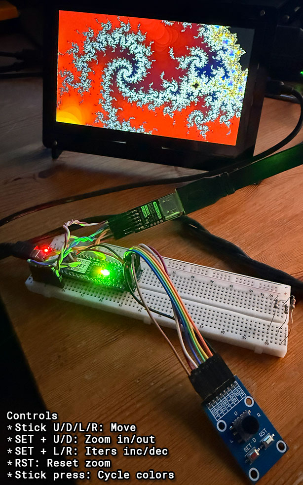
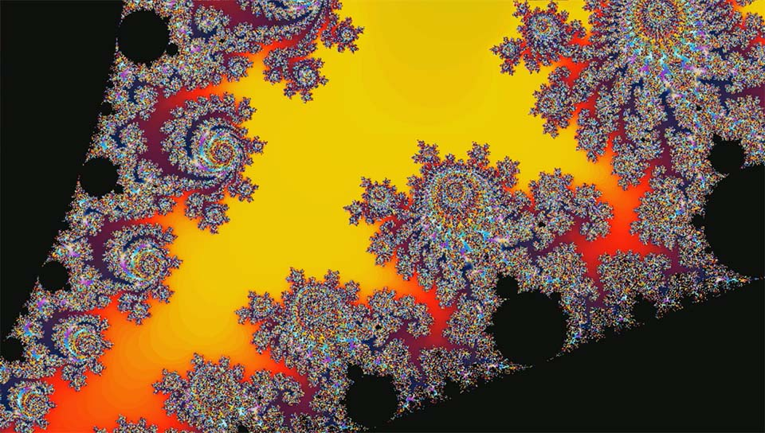
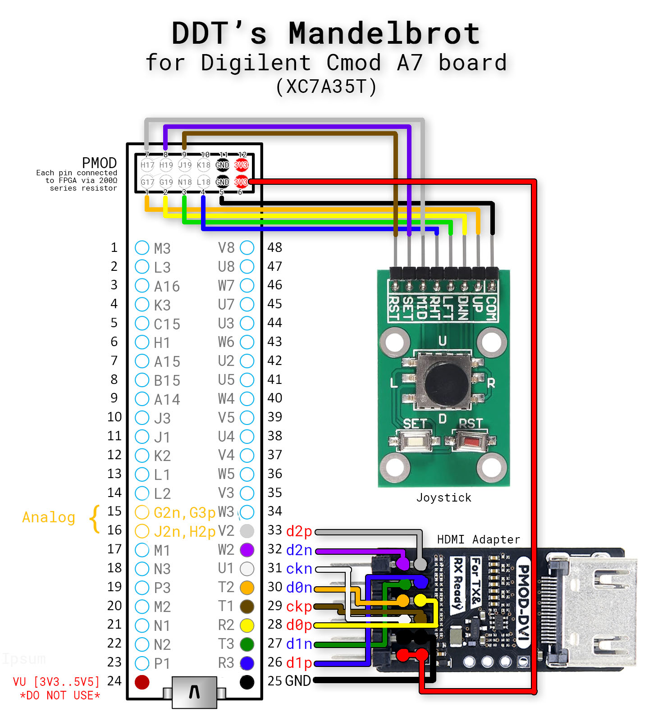
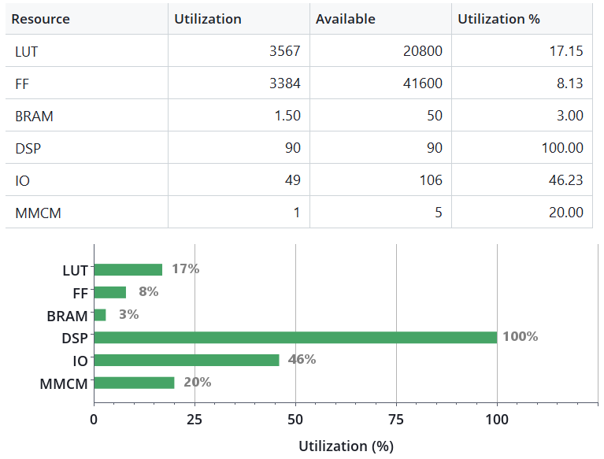

# mandel_CmodA7
## A fast (1.5 GigaIters/s) interactive Mandelbrot generator for the Digilent Cmod A7 FPGA board (XC7A35T)

Features:
- HDMI output: 960x544 @ 60Hz, 24-bit colors.
- Interactive controls via joystick board.
- 15 asynchronous parallel Mandelbrot cores for 1.5 GigaIters/s.
- Breadboard friendly.

# REQUIREMENTS

- Digilent CmodA7 FPGA trainer board.
- PMOD-DVI module for HDMI output.
- Digital joystick board, with at least one action button.
- HDMI display.

# CONTROLS

Use the joystick:
- Up, Down, Left, Right: Move around in complex plane.  

Keep SET (button 1) pressed for these actions:
- SET + Up: Zoom in 2x.
- SET + Down: Zoom out 2x.
- SET + Left: Increase iterations.
- SET + Right: Decrese iterations.

Stick-press (button 2) to cycle color palette.  

Press RST (button 3) to reset zoom.  

4-Digit LED display:
- If Center button is NOT pressed: Display current calculation line in hex [0x00..0xF0].
- If Center button is pressed: Display current max_iters per pixel in hex [0x010..0xFFF].

# SCHEMATIC
WARNING: Do not use pin 24 ("VU") of the Cmod A7 board to power components. Voltage on that pin varies depending on power source.  

# SUPPORTED RESOLUTIONS
- 960x544, RGB 8:8:8.

The default number of max iterations is 128, but the user can interactively change them in the range [16..4095].  

NOTE: The limited amount of SRAM (512 KB) in the Cmod A7 board only allows for a 960x544 (qHD) framebuffer.
NOTE: The simple coloring algorithm maps the lowest 8-bits of a pixel iterations to a palette of 256 colors.

# ALGORITHM

### Mandelbrot calculation

This is a brute force algorithm using Q3.22 fixed-point precision.  
We don't need heuristic optimizations, as we can reach interactive rates also at the maximum 4095 iters/pixel.  
The dirty work is done by the **15 Mandelbrot calculation cores** working in parallel at 100 MHz.  
Each core uses 6 DSP48E1 resources on the FPGA to calculate 1 Mandelbrot iteration per clock cycle. Aggregate computational power of all 15 cores (90 DSP) is 1.5 GigaIters/sec.  

Each cycle, if a core has completed calculation, we write the result to a dual-ported BRAM framebuffer storing up to two lines of the image (960x2 pixels). We also schedule calculation of new pixels to free cores.  
When a line in BRAM is complete, we flush it to SRAM as soon as we can (HDMI output has priority over SRAM).

### Note about fixed-point precision

There are two different fixed-point notations using "Q" numbers. TI and ARM. I am using ARM notation. More info here:  
https://en.wikipedia.org/wiki/Q_(number_format)  

The current implementation uses Q3.22 (25 bits total).  
The Mandelbrot set is contained in a circle with radius 2. However, during calculation, numbers greater than 2 are encountered, depending on the point being calculated.  
Here is the maximum magnitude reached for each point during the calculation:  

# SUPPORTED RESOLUTIONS

Q3.22 (25 bits) is the best compromise between max-zoom and speed for the Artix7 FPGA.  
We use 25-bit numbers to maximize usage of DSP48E1 resources in the Artix7.  
Even if we use 25-bits number, we can perform the Mandel escape test on mult partials using more bits. This is unlikely many CPU mult implementations, and allows using only 3 bits (Q3) for the integral part of the calculation registers, and allocate more bits (22) to the fractional part for a deeper zoom.

### FPGA Utilization

This is on a Xilinx XC7A35T. Notice how we use all 90 (100%) DSP48E1 blocks and only 3% BRAM (as HDMI and calculation buffers), while other FPGA resources are mostly free. 
We also use almost all external SRAM for the framebuffer (960x544 = 522240 bytes out of 524288).

# LICENSE

Creative Commons, CC BY

https://creativecommons.org/licenses/by/4.0/deed.en

Please add a link to this github project.
